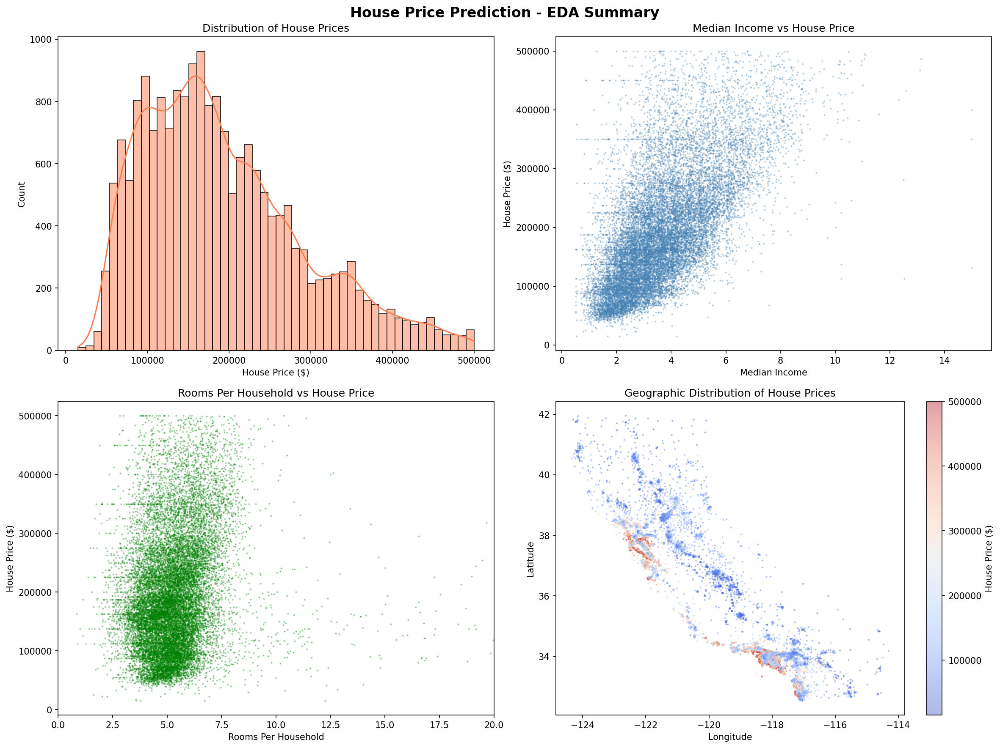

<div align="center">

# House Price AI

### Predicting California House Prices with Machine Learning

<p align="center">
  
</p>

<p align="center">
An end-to-end Machine Learning web application for predicting California house prices using regression models, built with React, Flask, and Scikit-Learn.
</p>

<p align="center">


</p>

### [Live Demo](https://house-price-ai-beta.vercel.app/)

</div>

---

## About The Project

**House Price AI** is an end-to-end Machine Learning web application developed as a **Full stack web developer**.

The project demonstrates a complete ML workflow — starting from raw dataset processing to training multiple machine learning models and deploying the best-performing model into a real-world full stack application.

The model predicts **California house prices** using data from the **California Housing Dataset (1990 US Census)**.

The dataset includes various housing-related features such as:

- Location
- Housing median age
- Population
- Total rooms
- Total bedrooms
- Median income

The primary objective of this project is to predict the **median house value** by comparing different regression models and selecting the most accurate one.

---

## Preview

### Web Application Interface

> Add your project screenshots here

```md

```

---

## Key Features

- Real-time house price prediction
- Interactive and responsive user interface
- End-to-end Machine Learning pipeline
- Data preprocessing and feature engineering
- Exploratory Data Analysis (EDA)
- Correlation analysis and visualizations
- Multiple regression model comparison
- Model evaluation and accuracy analysis
- Full stack deployment with React and Flask
- Mobile responsive modern interface

---

## Tech Stack

### Frontend

<p>
  
</p>

### Backend

<p>
  
</p>

### Machine Learning & Data Science

<p>
  
</p>

**Libraries Used**

<h2>Machine Learning & Data Science</h2>

<p align="left">

&nbsp;&nbsp;

&nbsp;&nbsp;

&nbsp;&nbsp;

&nbsp;&nbsp;


</p>

### Database

<p>
  
</p>

### Tools & Platforms

<p>
  
</p>

**Other Tools**
<h2>Tools & Platforms</h2>

<p align="left">
  
</p>

<p align="left">
  
  
  
  
</p>

---

## Machine Learning Models

The following regression models were implemented and compared during training:

| Model | Purpose |
|--------|----------|
| Linear Regression | Baseline model |
| Decision Tree Regressor | Pattern learning |
| Random Forest Regressor | Best performing model |
| Gradient Boosting Regressor | Performance comparison |

### Final Selected Model

**Random Forest Regressor**

**R² Score: 78.5%**

After evaluation, the Random Forest model achieved the best prediction performance and was selected for deployment.

---

## Project Workflow

```text
Dataset Collection (Kaggle)
        ↓
Data Understanding
        ↓
Data Preprocessing
        ↓
Exploratory Data Analysis (EDA)
        ↓
Feature Engineering
        ↓
Data Visualization
        ↓
Model Training
        ↓
Model Comparison
        ↓
Model Evaluation
        ↓
Best Model Selection
        ↓
Flask API Development
        ↓
React Frontend Development
        ↓
Deployment
```

---

## Dataset Information

The dataset was collected from **Kaggle** and converted into **CSV format** for analysis and model training.

### Input Features

- Longitude
- Latitude
- Housing Median Age
- Total Rooms
- Total Bedrooms
- Population
- Households
- Median Income

### Target Variable

**Median House Value**

---

## Project Structure

```bash
house-price-ai/
│
├── backend/
│   ├── app.py
│   ├── model.pkl
│   ├── requirements.txt
│
├── frontend/
│   ├── src/
│   ├── public/
│   └── components/
│
├── notebook/
│   ├── EDA.ipynb
│   └── model_training.ipynb
│
├── dataset/
│   └── housing.csv
│
└── README.md
```

---

## Installation & Setup

### Clone Repository

```bash
git clone https://github.com/khushisharma7891/house-price-ai.git
```

### Navigate to Project Directory

```bash
cd house-price-ai
```

### Backend Setup

```bash
pip install -r requirements.txt
python app.py
```

### Frontend Setup

```bash
npm install
npm run dev
```

---

## How It Works

1. The user enters housing details.

2. The data is sent to the Flask backend API.

3. The trained machine learning model processes the input.

4. The Random Forest model predicts the estimated house price.

5. The result is displayed instantly on the frontend.

---

## Future Improvements

- Advanced analytics dashboard
- Better prediction visualization
- AI-based recommendations
- Improved data insights
- Authentication system
- Additional datasets integration

---

## Author

**Khushi Sharma**  
Web Developer  
Machine Learning • Full Stack Development • UI/UX

GitHub:  
https://github.com/khushisharma7891

---

<div align="center">

Made with Python, React & Machine Learning

</div>
